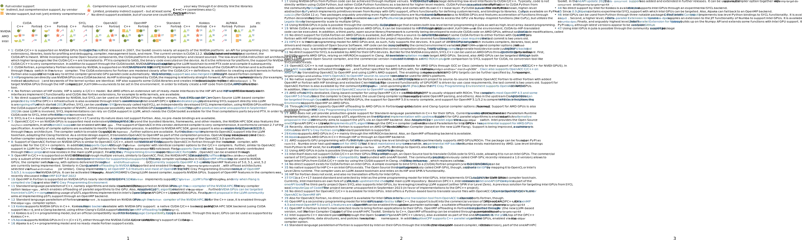

# GPU Vendor/Programming Model Compatibility Overview

There are three vendors of HPC-grade GPUs (NVIDIA, AMD, Intel), and many different programming models to use the devices for general computing. It's a zoo! This repository collects data about the state of support of the various combinations, for C/C++ and Fortran.

The initial collection was done for a presentation (v1.0), continued to a blog post (v1.2), and further extended to a proper paper (v2.0).

I'm happy to accept contributions for extension/correction. Please add issues or file a pull request (note the MIT license).

## Structure

The core of the work is the `compat.yml` file, the YAML-structured raw data. By scripts and templates, this data is converted to HTML or PDF (via LaTeX; an SVG version is created from the PDF as well). 

Files:

* `render_table.py`: Read in definitions from `compat.yml`, massage data, and generate HTML and/or LaTeX code. Can be either printed to screen and/or written to file. See `render_table.py -h`
* `compat.yml`: All the raw data, in YAML. Starts with SVG code for status icons. Then come the status assessments in form of dictionaries. And finally, a list of descriptions of the assessments.
* `templates/`: Folder for all templates to be consumed by the Python script, containing Jinja2 template files generating the respective code from the raw data. While a lot of the content is similar, there are some distinct differences – like how the footnotes are handled, because LaTeX is typeset while HTML is static.
* `output-fragments/`: Folder for generated files from the templates, plus skeletons containing boilerplate code to augment the generated files. For HTML, this is not much beyond the CSS; but for LaTeX this also includes some important definitions; but I did not want to cascade it any further.
* `Makefile`: Generate all of these. Check out `make html pdf svg`.

Also, `_gen-symbols/` exist, which is part of my exploration for all of this. I just might need it if I change the icons.

## SC23 P3HPC Paper

The template `table-template--descriptions.in.paper.tex` is a heavily modified version of the _standard_ TeX template extended to -- amongst others -- support references (from `references.bib`). Currently, the references are not supported in the HTML output. I'm happy to accept your pull request on this!

A preprint of the paper can be found at [arxiv.org/abs/2309.05445](https://arxiv.org/abs/2309.05445).

## SVG Snapshot

